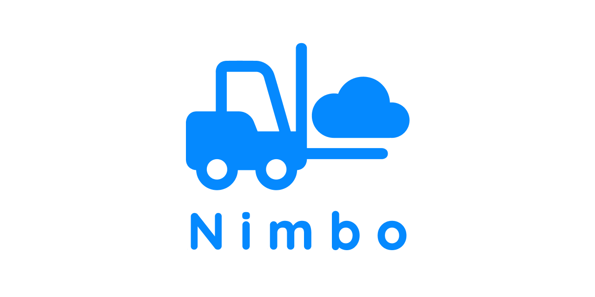

# 🌐 Nimbo WMS

**Nimbo WMS** is a modular and extensible Warehouse Management System designed to support essential warehouse operations such as receiving, putaway, storage, inventory tracking, and picking.  
The project is currently in active development and serves as a foundation for a future SaaS-oriented warehouse solution.

---

## 📘 Documentation

Looking for the domain model, architecture, or process descriptions?  
All project documentation is available in the **Nimbo WMS Wiki**:

➡️ **Wiki:** https://github.com/therealmoronto/nimbo-wms/wiki

---

## 🧩 Project Overview

Nimbo WMS aims to provide:

- A clean and flexible **domain model** for warehouse entities.  
- A lightweight, maintainable **backend architecture**.  
- Extensibility for advanced features such as batching, replenishment, wave picking, and integrations.  
- A foundation for a SaaS subscription model.

This repository contains the backend core of the system, including domain definitions, data structures, and architecture-related code.

---

## 🚧 Current Status

Nimbo WMS is in its **initial planning and design stage**:

- Designing core entities (Item, InventoryItem, Location, etc.)  
- Drafting ERD / database schema  
- Defining warehouse processes  
- Preparing architectural structure  
- Setting up development workflow (Projects, Wiki, Environments)

---

## 🗺 Roadmap (High-level)

- [x] Define core domain entities  
- [x] Implement backend domain models  
- [x] Create initial data storage layer  
- [ ] Implement receiving process flow  
- [ ] Implement putaway logic  
- [ ] Implement inventory tracking  
- [ ] Prepare first MVP integration interface  
- [ ] Deploy initial SaaS-ready backend prototype  

*(Detailed roadmap available in the Wiki.)*

---

## 🤝 Contributing

Contributions will be welcomed once the project reaches the public milestone.  
For now, development is internal and exploratory.

---

## 📄 License

License will be defined at a later stage depending on the project's release model.

---

## ✨ Maintained by

**Alex Moronto**  
Creator & Developer of Nimbo WMS  
