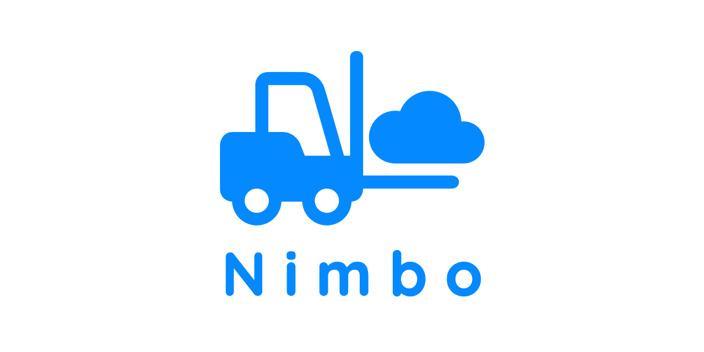

[](https://opensource.org/licenses/AGPL-3.0)
[](https://dotnet.microsoft.com/download/dotnet/10.0)
[](#-engineering-excellence)
[](https://github.com/therealmoronto/nimbo-wms/actions)

> **Empowering regional brands to reclaim independence through high-precision logistics. Nimbo unifies a professional Storefront and a Double-Entry WMS into a single, "no-sync" ecosystem.**

# 🌐 Nimbo Ecosystem: Decentralizing Logistics for SME



> **"Clean code, clean thoughts, clean phrases."** — The philosophy behind a system built to empower independence.

## 🚀 The Vision
**Nimbo** is the technological backbone of a decentralized logistics ecosystem designed to give Small and Medium Enterprises (SME) the power to thrive.

We are building more than just a Warehouse Management System; we are creating a foundation for professional logistics and independent commerce. Our mission is to provide a robust alternative to the "dictatorship" of global marketplaces, returning control, transparency, and data sovereignty back to regional brands and suppliers.

## 🛠 Engineering Excellence (The "Unfair Advantage")

Nimbo is built on a "Zero-Compromise" architectural foundation. Every line of code follows the principles of long-term maintainability and system stability, essential for mature enterprise systems.

### 💎 The Stock Ledger Engine
At the heart of Nimbo lies a high-integrity **Stock Ledger** built on the **Double-Entry principle**. 
* **Absolute Accuracy:** Every movement is a transaction. No "magic" balance updates — only verifiable ledger entries.
* **Auditability:** A complete, immutable history of every stock change, providing a "Source of Truth" that businesses can trust.
* **Consistency:** Strict domain invariants ensure that stock levels never become negative or inconsistent.

### 🏗 Architectural Pillars
* **Domain-Driven Design (DDD):** Deep domain modeling with strictly typed identifiers (`WarehouseId`, `ItemId`, etc.) and encapsulated business logic to prevent "anemic" models.
* **Clean Architecture:** Complete isolation of the core business logic from external frameworks, databases, and UI, ensuring the system remains testable and independent.
* **Production-Ready Persistence:** Optimized for PostgreSQL with advanced EF Core configurations, designed to handle complex warehouse topologies and high-load scenarios.
* **Comprehensive Testing:** A rigorous testing strategy including Unit and Integration tests to ensure core domain stability.

## 🗺 Roadmap: From Core to Ecosystem

Nimbo is evolving in four strategic phases, moving from a rock-solid warehouse engine to a full-scale decentralized commerce platform.

### Phase 1: The Core (Current)
* **High-Integrity Stock Ledger:** Finalizing the double-entry engine for 100% inventory precision.
* **Essential WMS Flows:** Implementing standardized Receiving, Shipping, Relocation, and Adjustment processes.
* **Domain Stability:** Achieving 90%+ test coverage for core business invariants using DDD principles.

### Phase 2: Connectivity & Integration
* **Open API for SME:** Providing a robust interface for local manufacturers to connect their existing tools.
* **E-commerce Connectors:** Ready-to-use webhooks and integrations for Shopify, WooCommerce, and local storefronts.
* **Multi-tenancy & Isolation:** Ensuring secure data partitioning for a scalable SaaS model.

### Phase 3: The Independent Storefront
* **Nimbo Storefront Engine:** A lightweight, decentralized marketplace builder directly linked to real-time warehouse stocks.
* **PIM System:** Integrated Product Information Management to help brands own their master data without marketplace locks.

### Phase 4: Scale & Intelligence
* **High-Load Optimization:** Implementing **CQRS** (Command Query Responsibility Segregation) to handle massive transaction volumes.
* **Distributed Logistics Network:** Features to enable SME warehouses to collaborate as a single decentralized logistics grid.
* **Predictive Analytics:** AI-driven stock optimization to help small brands manage cash flow effectively.

### Phase 5: Last-Mile Orchestration & End-to-End Visibility
* **Focus:** Developing orchestration protocols for transport management and delivery service integration.
* **Vision:** Closing the retail loop by connecting warehouse operations directly to the customer's doorstep.
* **Impact:** Unified "Last Mile" control and total supply chain transparency, providing SMEs with the same logistics power as global monopolies.

## 🛠 Getting Started

Nimbo is designed for ease of development and deployment. The core system is built with **.NET 8** and **PostgreSQL**.

### 🏗 Local Setup
1. **Clone the repository:**
   ```bash
   git clone https://github.com/therealmoronto/nimbo-wms.git
   ```
2. Initialize the environment:
   We provide automation scripts to set up your local infrastructure:
   ```bash
   # Initialize PostgreSQL and core settings
   ./ef_pg_init.sh
   # Apply latest migrations
   ./ef_update.sh
   ```
3. Run the solution:
   Open NimboWMS.sln in your preferred IDE or run:
   ```bash
   dotnet run --project Nimbo.Wms
   ```

Refer to [docs/development.md](./docs/development.md) for a detailed engineering guide.

## 🤝 Community & Philosophy

Nimbo is more than code; it's a movement toward a fairer, decentralized logistics landscape. We welcome engineers, domain experts, and visionaries who share our values:

* **Clean Code:** Expressive, typed, and maintainable.
* **Clean Thoughts:** Purposeful architecture without accidental complexity.
* **Clean Phrases:** Direct and honest communication.

## 📬 Contact & Contributions

Whether you want to contribute to the core ledger, discuss the decentralized storefront, or just talk about DDD — feel free to open an issue or reach out.

Founder & Lead Architect: [Alex Morgunov](https://github.com/therealmoronto)

**Vision:** Decentralizing logistics for a better SME future.

## 📄 License & Audit Notice

This project is licensed under the **GNU Affero General Public License v3.0 (AGPL-3.0)**. 

### 🛡 AGPL-3.0 Compliance (Network Trigger)

If you run Nimbo as a network service (SaaS), the AGPL-3.0 requires you to make your entire source code available to all users under the same license. This ensures the ecosystem remains open and prevents "private forking" for commercial gain.

### 🔍 Architectural Auditability & IP Protection

To protect the integrity of the project and our contributors, we actively monitor for unauthorized commercial use:
* **Digital Fingerprinting:** We utilize specific architectural patterns (including our proprietary **Stock Ledger** logic and DDD aggregates) as unique identifiers to track compliance.
* **Fork Monitoring:** Even partial or obfuscated derivatives of the Nimbo codebase are subject to audit and AGPL-3.0 enforcement.

### 💼 Commercial Licensing

For enterprises or startups requiring a private, closed-source deployment (Commercial License) without the disclosure requirements of the AGPL, please reach out to the founder directly.
